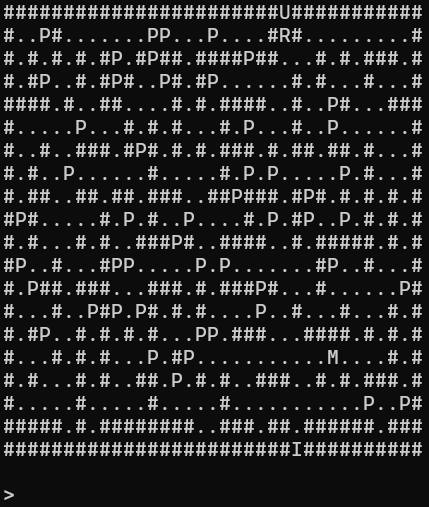

# Robot in Knossos

A terminal-based maze game written in C++ where a robot navigates a procedurally generated maze, collects power-ups, and tries to reach the exit while avoiding (or defeating) the Minotaur.

## Gameplay

The maze is randomly generated at each run using an iterative **Depth-First Search (DFS) with backtracking**. The player controls a robot (`R`) and must reach the exit (`I`) at the bottom of the maze. The Minotaur (`M`) roams the lower half of the maze and will attack if it reaches the robot.

Along the way, the robot can pick up special effect items (`P`) that last for a limited number of moves.



## Controls

| Key | Action     |
| --- | ---------- |
| `w` | Move up    |
| `s` | Move down  |
| `a` | Move left  |
| `d` | Move right |
| `q` | Quit       |

## Map Legend

| Symbol | Meaning        |
| ------ | -------------- |
| `#`    | Wall           |
| `.`    | Passage        |
| `R`    | Robot (player) |
| `M`    | Minotaur       |
| `U`    | Entrance       |
| `I`    | Exit           |
| `P`    | Effect item    |

## Special Effects

Each effect lasts for `EFFECT_DURATION` moves (defined in `const.h`):

| Effect  | Description                                 |
| ------- | ------------------------------------------- |
| Hammer  | Allows the robot to break through walls     |
| Shield  | Protects the robot from one Minotaur attack |
| Sword   | Kills the Minotaur on contact               |
| War Fog | Limits the visible area of the maze         |

## Build & Run

### Requirements

- C++17 or later
- `libmaze.a` (included) — static library for maze generation, must be linked

### Compile (g++)

```bash
g++ main.cpp game.cpp maze_generator.cpp matrix.cpp const.cpp -L. -lmaze -o maze_game -std=c++17
```

### Run

```bash
./maze_game <rows> <cols> <effects>
```

| Argument  | Description                     | Constraint   |
| --------- | ------------------------------- | ------------ |
| `rows`    | Number of rows in the maze      | Must be > 15 |
| `cols`    | Number of columns in the maze   | Must be > 15 |
| `effects` | Number of effect items to place | Must be > 3  |

**Example:**

```bash
./maze_game 21 35 6
```

### Test mazes

The `test/` folder contains pre-built maze layouts that can be loaded instead of generating a new one. To use them, swap the constructor call in `game.cpp` (see the commented line).

## Project Structure

```
├── main.cpp              # Entry point, argument parsing
├── game.h / game.cpp     # Core game logic (movement, input, effects)
├── maze_generator.h/.cpp # DFS maze generation
├── matrix.h / matrix.cpp # Grid representation
├── const.h / const.cpp   # Global constants and direction vectors
├── file_manager.h        # Save/load game state to file
├── effect.h              # Abstract base class for effects
├── hammer.h              # Break-wall effect
├── shield.h              # Protect-from-Minotaur effect
├── sword.h               # Kill-Minotaur effect
├── fog.h                 # Limited-visibility effect
├── cell.h                # Single cell in the grid
├── random_engine.h       # Random number generation
├── libmaze.a             # Pre-compiled static library
└── test/
    ├── maze1.txt
    ├── maze2.txt
    └── maze3.txt
```
